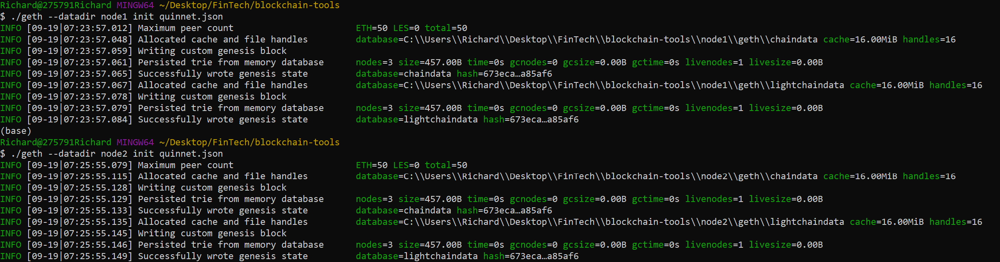

# Blockchain

## Proof of Authority

### Instruction
* Requires the instalation of blockchain tools and MyCrypto.com. See "blockchain_install_guide.md" for instructions


# Initialize ./puppeth command from command line. 
Documentation of setting up genesis block 
#### Network = quinnet
#### ChainID = 971

# Initialize Nodes

### ./geth --datadir node1 init quinnet.json
### ./geth --datadir node2 init quinnet.json
Documentation initializing the nodes 
#
#
## Run Nodes in seperate terminals to begin mining. 
```
./geth --datadir node1 --unlock  "0x73C3f54e89F21307d99362C32A634B8937a15E71" --mine --rpc --allow-insecure-unlock
```
```
./geth --datadir node2 --unlock "0x699F608aB72cC03EcFE1Ce5BCd5d228330152b86" --mine --port 30304 --bootnodes "enode://a37e43d894a846133b23be9bfb61883cd482d6935fca18c51886a4aed867f3a25b7fab33b4b98983ed0bccc70293aafc64a0909ea49c912ddd78be785f26f6f6@127.0.0.1:30303"  --allow-insecure-unlock
```

* The ```--mine``` flag tells the node to mine new blocks.

* The ```--bootnodes``` flag allows you to pass the network info needed to find other nodes in the blockchain. This will allow us to connect both of our nodes.

* The ```--rpc``` flag enables us to talk to our second node, which will allow us to use MyCrypto or Metamask to transact on our chain.

* The ```--allow-insecure-unlock``` Allow insecure account unlocking when account-related RPCs are exposed by http

* The ```enode://e1da6a73405ef8cc2555ef20e05b29d15edf47155d7d422d8be506e2307ff058285577f9eebe78f431eaa8091c5493bee7e150d78e5f81c0155d6ee3cf30fff0@127.0.0.1:30303``` is plucked from node 1 after we run node 1. 

### ** MAKE SURE YOU ARE IN THE blockchain_tools DIRECTORY WHEN RUNNING CODE **
### Node 1 Password: password
### Node 2 Password: password
#
#
## After both terminals are running both nodes, create "custom" network and attach "keynote" file from node 1 to network. 
 * See screenshot folder on ```add_custom_network.mov```


